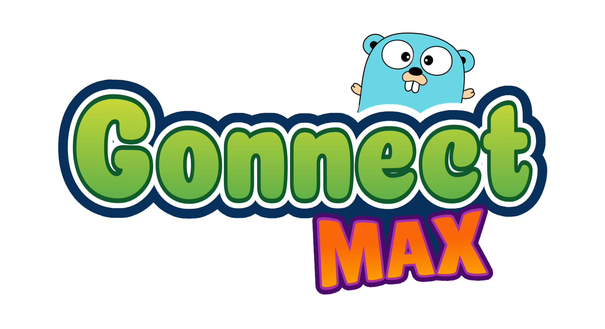

<a name="readme-top"></a>

<!-- PROJECT LOGO -->
<br />
<div align="center">
  <a href="https://github.com/swaiku/TicTacGo">
    
  </a>

  <h3 align="center">TicTacGo</h3>

  <p align="center">
    A modern, cross-platform Tic-Tac-Toe game written in Go using Ebitengine.
    <br />
    <a href="https://github.com/swaiku/TicTacGo"><strong>Explore the docs »</strong></a>
    <br />
    <br />
    <a href="https://swaiku.github.io/TicTacGo">View Demo</a>
    ·
    <a href="https://github.com/swaiku/TicTacGo/issues">Report Bug</a>
    ·
    <a href="https://github.com/swaiku/TicTacGo/issues">Request Feature</a>
  </p>
</div>


<!-- TABLE OF CONTENTS -->
<details>
  <summary>Table of Contents</summary>
  <ol>
    <li>
      <a href="#about-the-project">About The Project</a>
      <ul>
        <li><a href="#built-with">Built With</a></li>
      </ul>
    </li>
    <li>
      <a href="#getting-started">Getting Started</a>
      <ul>
        <li><a href="#prerequisites">Prerequisites</a></li>
        <li><a href="#installation">Installation</a></li>
      </ul>
    </li>
    <li><a href="#usage">Usage</a></li>
    <li><a href="#roadmap">Roadmap</a></li>
    <li><a href="#contributing">Contributing</a></li>
    <li><a href="#license">License</a></li>
    <li><a href="#contact">Contact</a></li>
    <li><a href="#acknowledgments">Acknowledgments</a></li>
  </ol>
</details>


<!-- ABOUT THE PROJECT -->
## About The Project

Gonnect Max is a robust implementation of the classic Tic-Tac-Toe game, engineered with Go and the Ebitengine 2D game library. It showcases how to build a scalable, cross-platform game with a responsive UI, AI opponents, and WebAssembly support for browser-based play.

Key features:
*   **Cross-Platform:** Runs natively on desktop (Linux, Windows, macOS) and in the browser via WebAssembly.
*   **AI Opponents:** Challenge yourself against AI algorithms (Minimax implementation).
*   **Responsive UI:** Window resizing support with a layout that adapts to dimensions.
*   **Clean Architecture:** Structured codebase separating game logic, UI, and screen management.

<p align="right">(<a href="#readme-top">back to top</a>)</p>


### Built With

[![Go][Go-Badge]][Go-url] [![Ebitengine][Ebiten-Badge]][Ebiten-url]

<p align="right">(<a href="#readme-top">back to top</a>)</p>


<!-- GETTING STARTED -->
## Getting Started

To get a local copy up and running, follow these simple steps.

### Prerequisites

*   Go 1.25 or higher
    ```sh
    # Verify your go version
    go version
    ```

### Installation

1.  Clone the repo
    ```sh
    git clone https://github.com/swaiku/TicTacGo.git
    ```
2.  Navigate to the project directory
    ```sh
    cd TicTacGo
    ```
3.  Install dependencies
    ```sh
    go mod tidy
    ```
4.  Run the game
    ```sh
    go run .
    ```

#### Building for WebAssembly

To build the game for the web:

1.  Run the build script:
    ```sh
    ./scripts/build_wasm.sh
    ```
2.  Serve the `dist` directory using a local web server (e.g., python or go-based server).

<p align="right">(<a href="#readme-top">back to top</a>)</p>


<!-- USAGE EXAMPLES -->
## Usage

Once the game is launched:
1.  **Main Menu:** You have three options, `Quick Local` that allow you to play again another player, `Quick vs AI` that allow you to play against an hard AI and `Customize` that allow you to change settings like board size or number and type of player.
2.  **Gameplay:** Basically a tic tac toe really customizable.
3.  **Objective:** Align marks in a row, column, or diagonal to win.


<p align="right">(<a href="#readme-top">back to top</a>)</p>


<!-- ROADMAP -->
## Roadmap

- [x] Basic Game Logic
- [x] UI Implementation (Ebitengine)
  - [ ] more generalized ui system
- [x] AI Opponent (Minimax)
  - [ ] implements more AI for more diffculties
- [x] WebAssembly Support
- [ ] Network Multiplayer using [libp2p](https://github.com/libp2p/libp2p)

See the [open issues](https://github.com/swaiku/TicTacGo/issues) for a full list of proposed features (and known issues).

<p align="right">(<a href="#readme-top">back to top</a>)</p>


<!-- CONTRIBUTING -->
## Contributing

Contributions are what make the open source community such an amazing place to learn, inspire, and create. Any contributions you make are **greatly appreciated**.

If you have a suggestion that would make this better, please fork the repo and create a pull request. You can also simply open an issue with the tag "enhancement".
Don't forget to give the project a star! Thanks again!

1.  Fork the Project
2.  Create your Feature Branch (`git checkout -b feature/AmazingFeature`)
3.  Commit your Changes (`git commit -m 'Add some AmazingFeature'`)
4.  Push to the Branch (`git push origin feature/AmazingFeature`)
5.  Open a Pull Request

<p align="right">(<a href="#readme-top">back to top</a>)</p>


<!-- LICENSE -->
## License

Distributed under the MIT License. See `LICENSE` for more information.

<p align="right">(<a href="#readme-top">back to top</a>)</p>


<!-- CONTACT -->
## Contact

Project Link: [https://github.com/swaiku/TicTacGo](https://github.com/swaiku/TicTacGo)

<p align="right">(<a href="#readme-top">back to top</a>)</p>


<!-- ACKNOWLEDGMENTS -->
## Acknowledgments

*   [Ebitengine](https://ebitengine.org/) - A dead simple 2D game library for Go.
*   [Best-README-Template](https://github.com/othneildrew/Best-README-Template)

This project has been developped in collaboration with [ZePyLaw](https://github.com/ZePyLaw) 🤍

<p align="right">(<a href="#readme-top">back to top</a>)</p>


<!-- MARKDOWN LINKS & IMAGES -->
<!-- https://www.markdownguide.org/basic-syntax/#reference-style-links -->
[Go-Badge]: https://img.shields.io/badge/Go-00ADD8?style=for-the-badge&logo=go&logoColor=white
[Go-url]: https://go.dev/
[Ebiten-Badge]: https://img.shields.io/badge/Ebitengine-DB4437?style=for-the-badge&logo=go&logoColor=white
[Ebiten-url]: https://ebitengine.org/
